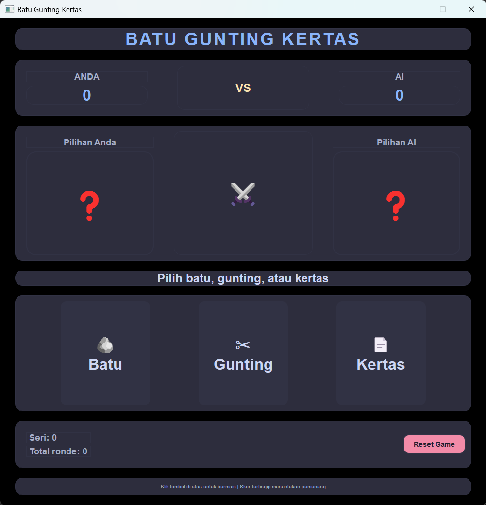

# 🎮 Batu Gunting Kertas

<div align="center">

**Aplikasi permainan Batu Gunting Kertas berbasis desktop dengan PyQt5**

</div>

## 📋 Deskripsi Proyek

**Batu Gunting Kertas** adalah aplikasi permainan klasik yang dikembangkan menggunakan Python dan PyQt5. Proyek ini menghadirkan antarmuka desktop sederhana untuk bermain melawan AI yang memilih secara acak.

Permainan ini menggunakan aturan standar:
- Batu mengalahkan gunting
- Gunting mengalahkan kertas
- Kertas mengalahkan batu

Fitur utama aplikasi ini:
- Pilih `Batu`, `Gunting`, atau `Kertas`
- AI memilih secara acak setiap ronde
- Skor pemain, skor AI, dan jumlah seri ditampilkan
- Reset permainan untuk memulai ulang skor dan ronde

## 📑 Daftar Isi

- [Deskripsi Proyek](#-deskripsi-proyek)
- [Tampilan Aplikasi](#-tampilan-aplikasi)
- [Latar Belakang](#-latar-belakang)
- [Fitur Utama](#-fitur-utama)
- [Teknologi yang Digunakan](#-teknologi-yang-digunakan)
- [Cara Penggunaan](#-cara-penggunaan)
- [Struktur File](#-struktur-file)
- [Peran Developer](#-peran-developer)
- [Ucapan Terima Kasih](#-ucapan-terima-kasih)

## 📸 Tampilan Aplikasi

### Tampilan Utama Permainan



## 🎯 Latar Belakang

Proyek ini dibuat untuk membuat versi digital sederhana dari permainan Batu Gunting Kertas dengan antarmuka desktop. Tujuan utamanya adalah:

- Mengimplementasikan logika permainan klasik dalam Python
- Membangun antarmuka pengguna menggunakan PyQt5
- Menampilkan hasil ronde dan statistik dalam tampilan yang mudah dibaca
- Menggunakan struktur proyek modular agar mudah dikembangkan

## 🌟 Fitur Utama

| Fitur | Deskripsi |
|------|-----------|
| **Pilihan Pemain** | Pemain memilih `Batu`, `Gunting`, atau `Kertas` melalui tombol interaktif |
| **AI Acak** | AI mengambil keputusan acak setiap ronde |
| **Skor dan Statistik** | Menampilkan skor pemain, skor AI, seri, dan total ronde |
| **Tampilan Responsif** | UI dengan gaya custom untuk tombol, panel, dan label |
| **Reset Game** | Tombol untuk mereset skor dan memulai ulang permainan |

## 🛠️ Teknologi yang Digunakan

| Teknologi | Fungsi | Alasan Penggunaan |
|-----------|--------|-------------------|
| **Python 3** | Bahasa pemrograman utama | Sederhana, cepat, dan mudah dikembangkan |
| **PyQt5** | GUI desktop | Membuat antarmuka aplikasi yang interaktif |
| **JSON** | Tidak digunakan langsung di game ini | Struktur data untuk kemungkinan pengembangan lanjutan |

### Library yang Digunakan

- `PyQt5` : Membuat jendela, tata letak, tombol, dan label
- `random` : Memilih pilihan AI secara acak

## 📦 Struktur File

| File | Fungsi |
|------|--------|
| **main.py** | Entry point aplikasi. Inisialisasi `QApplication` dan menampilkan jendela utama |
| **game/game_logic.py** | Logika permainan: menentukan pemenang, menghitung skor, dan mengelola statistik ronde |
| **ui/main_window.py** | Definisi antarmuka PyQt5 yang menampilkan tombol, skor, dan hasil |
| **ui/styles.py** | Styling CSS untuk tampilan aplikasi |
| **utils/constants.py** | Konstanta warna, ukuran jendela, pilihan game, dan aturan kemenangan |

## 🎮 Cara Penggunaan

### Menjalankan Aplikasi

1. Pastikan Python dan PyQt5 sudah terpasang.
2. Jalankan `main.py` dari folder `projects/game-batu-gunting-kertas`:
   ```bash
   python main.py
   ```
3. Jendela permainan akan muncul.

### Cara Bermain

1. Klik tombol `Batu`, `Gunting`, atau `Kertas`.
2. AI akan memilih jawaban secara acak.
3. Hasil ronde akan ditampilkan di tengah layar.
4. Skor akan diperbarui secara otomatis.
5. Klik `Reset Game` untuk mulai ulang skor dan ronde.

## 👨‍💻 Peran Developer

| Area | Kontribusi |
|------|------------|
| **UI/UX** | Mendesain antarmuka PyQt5 yang sederhana dan mudah digunakan |
| **Game Logic** | Mengimplementasikan aturan Batu Gunting Kertas dan sistem skor |
| **Styling** | Menambahkan tema warna dan gaya untuk tombol serta label |
| **Arsitektur** | Memisahkan kode ke dalam modul `game`, `ui`, dan `utils` |

## 🙏 Ucapan Terima Kasih

Terima kasih telah melihat proyek ini. Semoga permainan ini bermanfaat sebagai contoh aplikasi desktop sederhana dengan Python dan PyQt5.

<div align="center">

**⭐ Jika proyek ini membantu, silakan beri bintang! ⭐**

**"Batu Gunting Kertas: sederhana, cepat, dan seru dimainkan."**

</div>