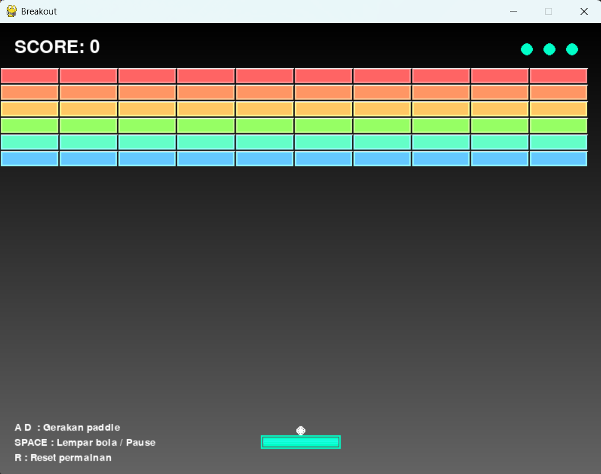
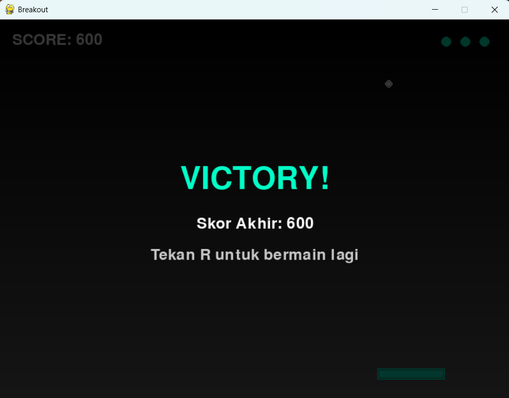

# 🎮 Breakout Game

<div align="center">

**Aplikasi permainan Breakout berbasis desktop dengan Pygame**

</div>

## 📋 Deskripsi Proyek

**Breakout Game** adalah aplikasi game desktop yang dibuat menggunakan Python dan Pygame. Pemain mengendalikan paddle untuk memantulkan bola, menghancurkan seluruh deretan brick, dan mempertahankan nyawa sampai semua brick musnah.

Permainan ini menampilkan kontrol sederhana, efek visual gradasi, sistem skor, dan kondisi game over/victory.

Fitur utama aplikasi ini:
- Gameplay Breakout klasik dengan paddle, bola, dan brick
- Sistem skor dan nyawa
- Efek visual: gradasi latar, glow, dan flash saat brick dihancurkan
- Kontrol keyboard yang responsif
- Reset game dan mode pause

## 📑 Daftar Isi

- [Deskripsi Proyek](#-deskripsi-proyek)
- [Tampilan Aplikasi](#-tampilan-aplikasi)
- [Fitur Utama](#-fitur-utama)
- [Teknologi yang Digunakan](#-teknologi-yang-digunakan)
- [Penjelasan File](#-penjelasan-file)
- [Cara Penggunaan](#-cara-penggunaan)
- [Peran Developer](#-peran-developer)
- [Pembelajaran dari Proyek](#-pembelajaran-dari-proyek-lessons-learned)
- [Ucapan Terima Kasih](#-ucapan-terima-kasih)

## 📸 Tampilan Aplikasi

### Tampilan Permainan




### Tampilan Game Over / Victory




## 🎯 Fitur Utama

### 🎮 Gameplay Breakout Klasik

| Fitur | Deskripsi |
|-------|-----------|
| **Kontrol Paddle** | Paddle bergerak dengan `A`, `D`, `LEFT`, `RIGHT` |
| **Lempar Bola** | Tekan `SPACE` untuk melepas bola saat awal permainan |
| **Pause** | Tekan `SPACE` untuk pause/unpause saat bola sudah bergerak |
| **Reset** | Tekan `R` untuk memulai ulang permainan |
| **Nyawa** | Pemain memiliki 3 nyawa sebelum game over |
| **Brick** | Brick diberi warna berbeda untuk efek visual |

### 🔥 Sistem Skor dan Nyawa

| Fitur | Deskripsi |
|-------|-----------|
| **Skor** | Orang mendapatkan 10 poin setiap menghancurkan brick |
| **Nyawa** | Kehilangan bola mengurangi nyawa satu |
| **Game Over** | Terjadi ketika nyawa habis |
| **Victory** | Terjadi ketika semua brick berhasil dihancurkan |

### ✨ Efek Visual

| Komponen | Deskripsi |
|----------|-----------|
| **Background Gradasi** | Latar bergradasi dari gelap ke terang |
| **Glow** | Efek glow pada paddle dan bola |
| **Flash** | Flash sejenak saat brick terkena bola |
| **Border Brick** | Brick diberi garis highlight untuk efek 3D |

## 🛠️ Teknologi yang Digunakan

### Core Technologies

| Teknologi | Fungsi | Alasan Penggunaan |
|-----------|--------|-------------------|
| **Python 3.x** | Bahasa pemrograman utama | Sederhana dan cocok untuk game 2D |
| **Pygame** | Game engine | Menangani window, input, gambar, dan loop game |

### Library yang Digunakan

| Library | Fungsi |
|---------|--------|
| **pygame** | Rendering, event handling, suara, input |
| **sys** | Keluar dari aplikasi |

## 📄 Penjelasan File

### File Utama

| File | Fungsi |
|------|--------|
| **main.py** | Entry point game. Menginisialisasi Pygame, loop utama, input, update, dan render |
| **config.py** | Konfigurasi utama: ukuran layar, warna, kecepatan, ukuran paddle/bola/brick |

### Package `entities/`

| File | Fungsi |
|------|--------|
| **entities/paddle.py** | Kelas `Paddle` untuk mengendalikan gerakan, batas layar, dan render |
| **entities/ball.py** | Kelas `Ball` untuk logika gerakan bola, pantulan, dan tabrakan |
| **entities/brick.py** | Kelas `Brick` dan `BrickManager` untuk membuat, menampilkan, dan mendeteksi tabrakan brick |

### Package `utils/`

| File | Fungsi |
|------|--------|
| **utils/draw.py** | Fungsi utilitas menggambar teks, background gradasi, dan shape sederhana |

## 🎮 Cara Penggunaan

### Menjalankan Game

1. Pastikan Python dan Pygame sudah terpasang.
2. Buka terminal pada folder `projects/game-breakout`.
3. Jalankan:

```bash
python main.py
```

### Kontrol Permainan

| Aksi | Tombol |
|------|--------|
| **Gerakkan paddle ke kiri** | `A` atau `LEFT` |
| **Gerakkan paddle ke kanan** | `D` atau `RIGHT` |
| **Lempar bola / Pause** | `SPACE` |
| **Reset permainan** | `R` |

### Tujuan Game

Hancurkan semua brick menggunakan bola dengan memantulkannya dari paddle. Jangan sampai bola jatuh ke bawah layar sampai nyawa habis.

## 👨‍💻 Peran Developer

### Kontribusi Utama

| Area | Kontribusi |
|------|------------|
| **Desain Game** | Membuat mekanik Breakout yang responsif dan intuitif |
| **Pengembangan Logika** | Menangani gerakan bola, tumbukan, skor, dan kondisi kemenangan/kalah |
| **Antarmuka Visual** | Menambahkan background gradasi, glow, dan efek flash |
| **Arsitektur Modular** | Memisahkan komponen menjadi `entities/`, `utils/`, dan `config.py` |

## 📚 Pembelajaran dari Proyek

### Keterampilan Teknis

1. Membuat game 2D dengan Pygame
2. Mengatur loop permainan dan event handling
3. Mengimplementasikan logika tumbukan dan pemantulan
4. Mendesain struktur file yang modular
5. Mengelola state game: pause, reset, game over, victory

### Soft Skills

- Problem solving saat mendesain mekanik game
- Perencanaan alur kontrol dan feedback visual
- Pemecahan kode menjadi modul agar mudah dikembangkan

## 🙏 Ucapan Terima Kasih

### Referensi

- [Pygame Documentation](https://www.pygame.org/docs/) - Dokumentasi resmi Pygame
- [Python Documentation](https://docs.python.org/3/) - Referensi bahasa Python

### Inspirasi Proyek

- **Game Breakout klasik** - Mekanik memantulkan bola untuk menghancurkan brick
- **Visual efek sederhana** - Meningkatkan tampilan dengan gradasi dan glow

---

<div align="center">

**⭐ Jika proyek ini menarik, berikan bintang di GitHub! ⭐**

</div>
