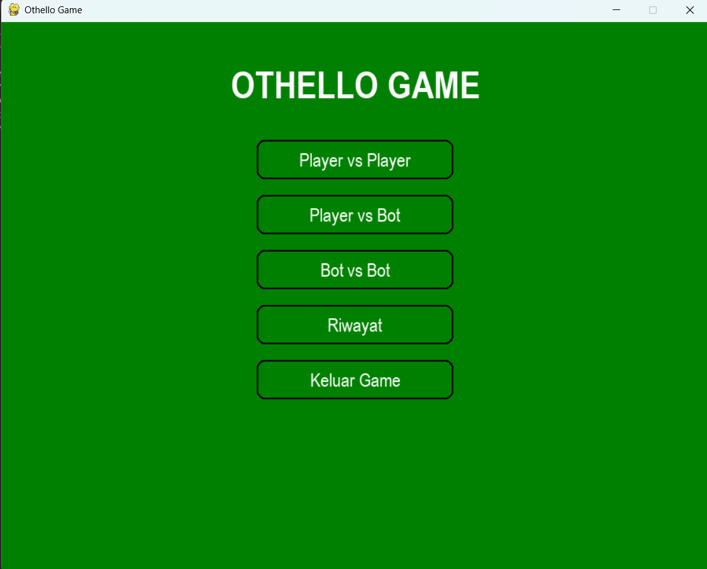
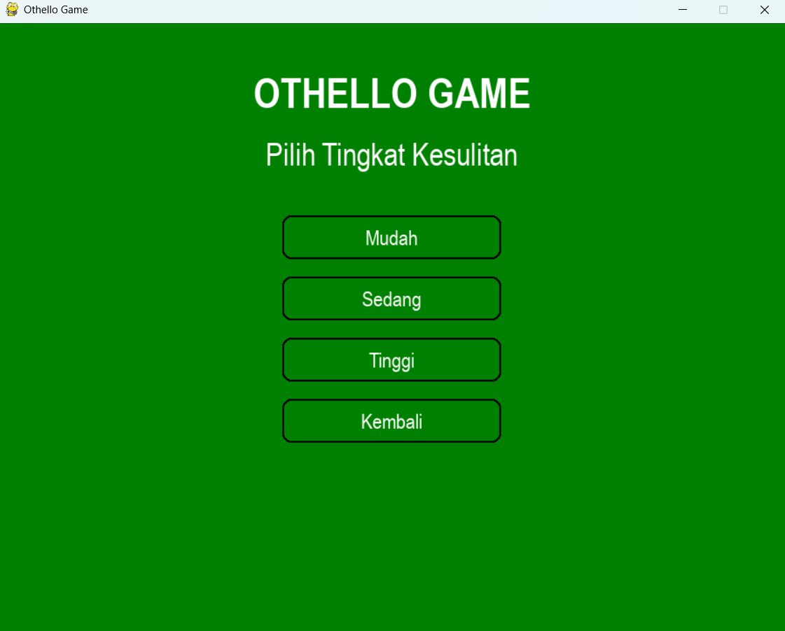
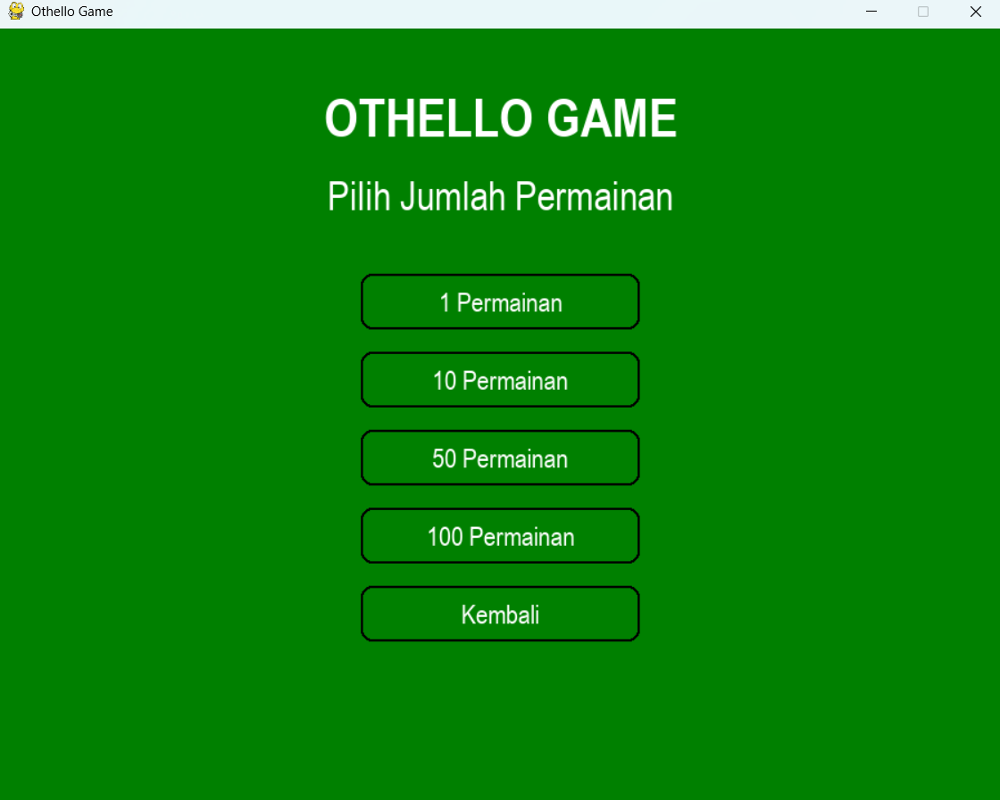
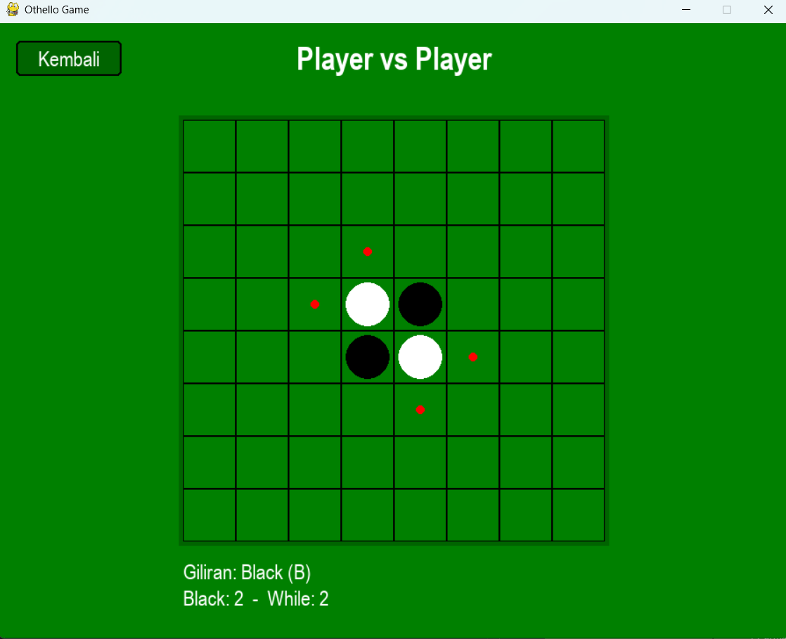
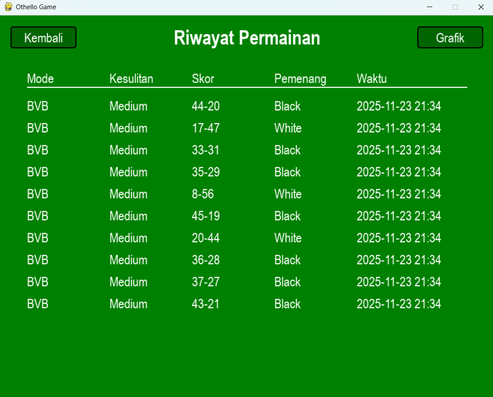
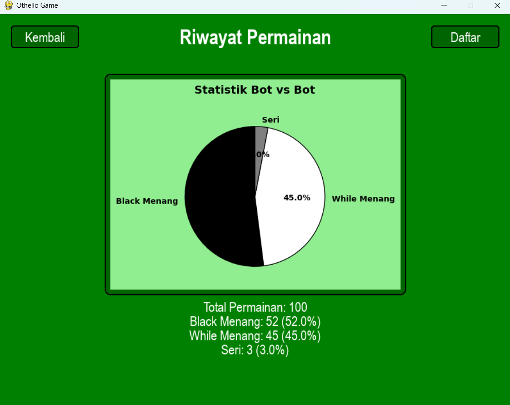

# 🎮 Othello Game

**Aplikasi permainan Othello berbasis desktop dengan Pygame dan AI**

## 📋 Deskripsi Proyek

**Othello Game** adalah aplikasi permainan papan Othello berbasis desktop yang dikembangkan menggunakan Pygame untuk antarmuka grafis. Proyek ini menawarkan tiga mode permainan yang berbeda, AI dengan tiga tingkat kesulitan, dan sistem penyimpanan riwayat permainan dengan visualisasi statistik.

Permainan Othello dimainkan di papan 8x8 dengan dua pemain (Hitam dan Putih). Tujuannya adalah memiliki lebih banyak bidak di papan pada akhir permainan dengan cara menjepit bidak lawan di antara dua bidak sendiri.

Fitur utama aplikasi ini:
- Tiga Mode Permainan: Player vs Player, Player vs Bot, Bot vs Bot
- AI dengan Tiga Tingkat Kesulitan: Mudah, Sedang, Sulit
- Visualisasi Statistik: Grafik pie untuk analisis performa Bot vs Bot
- Riwayat Permainan: Penyimpanan hasil permainan ke file JSON

## 📑 Daftar Isi

- [Deskripsi Proyek](#-deskripsi-proyek)
- [Tampilan Aplikasi](#-tampilan-aplikasi)
- [Latar Belakang](#-latar-belakang)
- [Fitur Utama](#-fitur-utama)
- [Teknologi yang Digunakan](#-teknologi-yang-digunakan)
- [Cara Penggunaan](#-cara-penggunaan)
- [Peran Developer](#-peran-developer)
- [Pembelajaran dari Proyek](#-pembelajaran-dari-proyek-lessons-learned)
- [Ucapan Terima Kasih](#-ucapan-terima-kasih)

## 📸 Tampilan Aplikasi

### Tampilan Menu Utama

### Tampilan Menu Player vs Bot

### Tampilan Menu Bot vs Bot

### Tampilan Papan Permainan

### Tampilan Riwayat Permainan

### Tampilan Grafik Statistik Bot vs Bot

## 🎯 Latar Belakang

Proyek ini dibuat untuk mengembangkan keterampilan dalam:

- **Pengembangan Game dengan Pygame**: Mempelajari cara membuat game interaktif dengan library Pygame
- **Kecerdasan Buatan (AI)**: Mengimplementasikan algoritma Minimax dengan evaluasi posisi untuk AI lawan
- **Manajemen State**: Mengelola state permainan dengan berbagai mode dan tingkat kesulitan
- **Visualisasi Data**: Mengintegrasikan Matplotlib dengan Pygame untuk menampilkan grafik statistik
- **Arsitektur Modular**: Mendesain aplikasi dengan struktur folder yang rapi dan modular

Kebutuhan yang melatarbelakangi proyek ini:
- **Keinginan untuk membuat game klasik** dengan sentuhan modern
- **Eksplorasi AI dalam game** dengan berbagai tingkat kesulitan
- **Pembelajaran tentang algoritma pencarian** seperti Minimax
- **Kebutuhan untuk menganalisis performa AI** melalui statistik Bot vs Bot
- **Pengembangan portofolio** untuk menunjukkan kemampuan Python dan Pygame

## 🌟 Fitur Utama

### 🎮 **Tiga Mode Permainan**

| Mode | Deskripsi | Pemain |
|------|-----------|--------|
| **Player vs Player (PvP)** | Dua pemain bergantian di komputer yang sama | Manusia vs Manusia |
| **Player vs Bot (PvB)** | Pemain melawan AI dengan tingkat kesulitan | Manusia vs AI |
| **Bot vs Bot (BvB)** | Dua AI saling bertanding dalam beberapa game | AI vs AI |

### 🤖 **AI dengan Tiga Tingkat Kesulitan**

| Tingkat | Random Factor | Strategi |
|---------|---------------|----------|
| **Mudah (Easy)** | 80% random | Prioritaskan sudut, hindari samping sudut |
| **Sedang (Medium)** | 30% random | Pertimbangkan posisi dan jumlah bidak yang dibalik |
| **Sulit (Hard)** | 10% random | Menggunakan Minimax dengan depth 2 |

### 🧠 **Algoritma AI**

| Komponen | Deskripsi |
|----------|-----------|
| **Minimax** | Algoritma pencarian untuk menentukan gerakan terbaik |
| **Evaluasi Posisi** | Menilai posisi berdasarkan sudut, bidak stabil, mobilitas |
| **Game Phase Detection** | Strategi berbeda untuk early, mid, dan late game |
| **Random Factor** | Variasi untuk tingkat kesulitan berbeda |

### 📊 **Statistik dan Riwayat**

| Fitur | Deskripsi | Implementasi |
|-------|-----------|--------------|
| **Penyimpanan Riwayat** | Menyimpan setiap permainan ke JSON | `save_game_history()` |
| **Daftar Riwayat** | Menampilkan 10 permainan terbaru | `load_game_history()` |
| **Grafik Pie** | Visualisasi statistik Bot vs Bot | Matplotlib + Pygame |
| **Filter Data** | Hanya game BvB yang ditampilkan di grafik | List comprehension |

### 🎨 **Antarmuka Pengguna**

| Komponen | Deskripsi |
|----------|-----------|
| **Menu Utama** | 5 tombol untuk navigasi utama |
| **Menu PvB** | 4 tombol untuk memilih tingkat kesulitan |
| **Menu BvB** | 5 tombol untuk memilih jumlah permainan |
| **Papan Permainan** | Grid 8x8 dengan bidak berwarna |
| **Informasi Pemain** | Giliran, skor, dan mode permainan |
| **Tombol Kembali** | Kembali ke menu sebelumnya |

### 📈 **Sistem Evaluasi AI**

| Metode Evaluasi | Bobot | Deskripsi |
|-----------------|-------|-----------|
| **Sudut** | +25 | Memiliki sudut sangat menguntungkan |
| **Bidak Stabil** | +2 per bidak | Bidak yang tidak bisa dibalik |
| **Mobilitas** | +3 per gerakan (early), +1 per gerakan (late) | Jumlah gerakan valid |
| **Jumlah Bidak** | Variabel | Selisih jumlah bidak |

## 🛠️ Teknologi yang Digunakan

### Core Technologies

| Teknologi | Fungsi | Alasan Penggunaan |
|-----------|--------|-------------------|
| **Python 3.7+** | Bahasa pemrograman utama | Mudah dipelajari, library melimpah |
| **Pygame** | Game engine dan GUI | Membuat game interaktif dengan mudah |
| **Matplotlib** | Visualisasi data | Membuat grafik statistik |
| **JSON** | Penyimpanan data | Format ringan untuk riwayat permainan |

### Library yang Digunakan

| Library | Fungsi | Penggunaan |
|---------|--------|------------|
| **pygame** | Game engine | `pygame.display`, `pygame.draw`, `pygame.font` |
| **matplotlib** | Visualisasi | `plt.pie()` untuk grafik statistik |
| **json** | Data persistence | Menyimpan/memuat riwayat permainan |
| **datetime** | Timestamp | Mencatat waktu permainan |
| **random** | Randomization | Random factor untuk AI |
| **math** | Matematika | Perhitungan dalam AI |

### Penjelasan File

#### File Utama

| File | Fungsi |
|------|--------|
| **src/main.py** | Entry point aplikasi. Menginisialisasi Pygame dan menjalankan menu utama. |

#### Package `game/` (Logika Permainan)

| File | Fungsi |
|------|--------|
| **game/board.py** | Kelas `Board` untuk merepresentasikan papan permainan 8x8. Menangani validasi gerakan, eksekusi gerakan, perhitungan skor, dan pengecekan game over. |
| **game/ai.py** | Kelas `OthelloAI` untuk kecerdasan buatan. Implementasi tiga tingkat kesulitan (easy, medium, hard) dengan algoritma Minimax. |
| **game/game_logic.py** | Kelas `GameLogic` untuk logika utama permainan. Menghubungkan board dengan AI, menangani mode permainan, dan menyimpan hasil. |

#### Package `gui/` (Antarmuka Pengguna)

| File | Fungsi |
|------|--------|
| **gui/main_menu.py** | Kelas `MainMenu` dan `Button` untuk menu utama. Menangani navigasi antara PvP, PvB, BvB, dan History. |
| **gui/game_window.py** | Kelas `GameWindow` untuk jendela permainan. Menampilkan papan, bidak, skor, dan menangani input mouse. |
| **gui/history_window.py** | Kelas `HistoryWindow` untuk menampilkan riwayat permainan. Menampilkan daftar dan grafik statistik. |

#### Package `utils/` (Utilitas)

| File | Fungsi |
|------|--------|
| **utils/constants.py** | Konstanta warna, ukuran papan, dan arah untuk pengecekan gerakan. |
| **utils/helpers.py** | Fungsi helper: `save_game_history()` untuk menyimpan riwayat ke JSON, `load_game_history()` untuk memuat riwayat. |

#### Data

| File | Fungsi |
|------|--------|
| **data/game_history.json** | File JSON yang menyimpan semua riwayat permainan dengan format: mode, difficulty, black_score, white_score, winner, game_number, timestamp. |

## 🎮 Cara Penggunaan

### Menu Utama

Setelah aplikasi dijalankan, Anda akan melihat menu utama dengan 5 pilihan:

| Tombol | Fungsi |
|--------|--------|
| **Player vs Player** | Mode dua pemain di komputer yang sama |
| **Player vs Bot** | Mode melawan AI (pilih tingkat kesulitan) |
| **Bot vs Bot** | Mode AI vs AI (pilih jumlah permainan) |
| **Riwayat** | Melihat riwayat dan statistik permainan |
| **Keluar Game** | Menutup aplikasi |

### Mode Player vs Player

**Cara bermain:**
1. Pilih **"Player vs Player"** dari menu utama
2. Pemain Hitam (B) mulai lebih dulu
3. Klik pada sel yang ditandai titik merah untuk meletakkan bidak
4. Giliran bergantian antara Hitam dan Putih
5. Permainan berakhir ketika tidak ada gerakan valid untuk kedua pemain

**Aturan Othello:**
- Bidak harus ditempatkan di sel yang dapat menjepit bidak lawan
- Setiap bidak lawan yang terjepit akan dibalik menjadi milik Anda
- Pemain dengan bidak terbanyak di akhir permainan menang

### Mode Player vs Bot

**Cara bermain:**
1. Pilih **"Player vs Bot"** dari menu utama
2. Pilih tingkat kesulitan: **Mudah**, **Sedang**, atau **Sulit**
3. Anda akan menjadi pemain Hitam (B), Bot menjadi Putih (W)
4. Klik pada sel yang ditandai titik merah untuk bergerak
5. Bot akan bergerak otomatis setelah jeda 0.5 detik

**Tingkat Kesulitan Bot:**

| Tingkat | Deskripsi | Cocok untuk |
|---------|-----------|-------------|
| **Mudah** | Sering membuat gerakan random, mudah dikalahkan | Pemula |
| **Sedang** | Seimbang antara random dan strategi | Kasual |
| **Sulit** | Menggunakan Minimax, jarang random | Pro |

### Mode Bot vs Bot

**Cara bermain:**
1. Pilih **"Bot vs Bot"** dari menu utama
2. Pilih jumlah permainan: **1**, **10**, **50**, atau **100**
3. Kedua bot akan bermain dengan tingkat kesulitan **Sedang**
4. Anda dapat menyaksikan pertandingan AI vs AI
5. Setiap permainan akan disimpan ke riwayat

**Jumlah Permainan:**

| Pilihan | Kegunaan |
|---------|----------|
| **1 Permainan** | Melihat satu pertandingan singkat |
| **10 Permainan** | Analisis performa singkat |
| **50 Permainan** | Statistik lebih akurat |
| **100 Permainan** | Analisis mendalam performa AI |

### Riwayat dan Statistik

**Melihat Daftar Riwayat:**
1. Pilih **"Riwayat"** dari menu utama
2. Anda akan melihat 10 permainan terbaru dalam bentuk tabel
3. Kolom: Mode, Kesulitan, Skor, Pemenang, Waktu

**Melihat Grafik Statistik:**
1. Di jendela Riwayat, klik tombol **"Grafik"**
2. Grafik pie akan menampilkan statistik untuk mode **Bot vs Bot** saja
3. Informasi detail: Total permainan, persentase kemenangan Hitam/Putih/Seri
4. Klik **"Daftar"** untuk kembali ke tampilan daftar

### Navigasi Antar Jendela

| Tombol | Fungsi |
|--------|--------|
| **Kembali** | Kembali ke menu sebelumnya |
| **Grafik/Daftar** | Toggle antara grafik dan daftar di History |
| **Tutup** | Menutup jendela game over dan kembali ke menu |

### Kontrol

| Aksi | Cara |
|------|------|
| **Memilih menu** | Klik tombol dengan mouse |
| **Meletakkan bidak** | Klik pada sel papan yang ditandai titik merah |
| **Kembali** | Klik tombol "Kembali" di pojok kiri atas |
| **Keluar game** | Klik tombol "Keluar Game" di menu utama |

## 👨‍💻 Peran Developer

### Peran dalam Proyek

| Area | Kontribusi |
|------|------------|
| **Perencanaan** | Merancang fitur-fitur aplikasi Othello dengan tiga mode permainan |
| **Desain Arsitektur** | Mendesain struktur folder modular (game/, gui/, utils/) |
| **Pengembangan Game Logic** | Implementasi kelas `Board` untuk aturan Othello |
| **Pengembangan AI** | Implementasi kelas `OthelloAI` dengan tiga tingkat kesulitan dan algoritma Minimax |
| **Pengembangan GUI** | Membangun antarmuka dengan Pygame (menu, papan, tombol) |
| **Visualisasi Data** | Integrasi Matplotlib dengan Pygame untuk grafik statistik |
| **Manajemen Data** | Penyimpanan riwayat ke JSON dengan timestamp |
| **UI/UX Design** | Mendesain tampilan menu, papan, dan navigasi yang intuitif |
| **Testing** | Menguji semua mode permainan dan tingkat kesulitan |

### Fokus Pengembangan

1. **Fungsionalitas Inti**
   - Aturan Othello yang akurat (validasi gerakan, pembalikan bidak)
   - Tiga mode permainan yang berbeda
   - AI dengan tingkat kesulitan bervariasi

2. **User Experience**
   - Navigasi menu yang jelas dengan tombol
   - Visual feedback untuk gerakan valid (titik merah)
   - Informasi pemain dan skor yang mudah dibaca

3. **AI dan Strategi**
   - Algoritma Minimax untuk AI tingkat sulit
   - Evaluasi posisi berdasarkan sudut, stabilitas, mobilitas
   - Random factor untuk tingkat kesulitan mudah/sedang

4. **Data dan Analisis**
   - Penyimpanan riwayat untuk semua permainan
   - Grafik statistik untuk mode Bot vs Bot
   - Format timestamp untuk pelacakan waktu

## 📚 Pembelajaran dari Proyek (Lessons Learned)

### Keterampilan Teknis yang Diperoleh

1. Pygame untuk Game Development
2. Algoritma Minimax untuk AI
3. Evaluasi Posisi untuk Othello
4. Integrasi Matplotlib dengan Pygame
5. Manajemen State Permainan
6. Penyimpanan Data JSON
7. Deteksi Fase Permainan
8. Random Factor untuk Variasi AI

### Soft Skills yang Dikembangkan

#### 1. **Problem Decomposition**
- Memecah game kompleks menjadi komponen: board, AI, GUI, data
- Memisahkan logika permainan dari antarmuka
- Mendesain hirarki kelas yang jelas

#### 2. **Algorithm Design**
- Merancang algoritma Minimax untuk AI
- Mengembangkan fungsi evaluasi dengan berbagai faktor
- Menyeimbangkan random dan strategi untuk tingkat kesulitan

#### 3. **User Experience Design**
- Mendesain menu yang intuitif dengan tombol
- Memberikan visual feedback untuk gerakan valid
- Menampilkan informasi skor dan giliran dengan jelas

#### 4. **Data Analysis**
- Mengumpulkan data dari mode Bot vs Bot
- Menganalisis performa AI melalui statistik
- Memvisualisasikan data dengan grafik pie

## 🙏 Ucapan Terima Kasih

### Sumber Daya dan Referensi

#### Dokumentasi Resmi
- [Pygame Documentation](https://www.pygame.org/docs/) - Game engine
- [Matplotlib Documentation](https://matplotlib.org/stable/contents.html) - Visualisasi data
- [Python Documentation](https://docs.python.org/3/) - Bahasa pemrograman

#### Tutorial dan Artikel
- **Pygame Tutorials** - Untuk mempelajari dasar-dasar Pygame
- **Othello Strategy Guide** - Untuk memahami strategi permainan
- **Minimax Algorithm Explained** - Untuk implementasi AI

#### Tools yang Membantu
- **GitHub** - Hosting repository dan version control
- **Visual Studio Code** - Editor kode

### Inspirasi Proyek
- **Game Othello klasik** - Aturan dan mekanisme dasar
- **AI dalam game** - Konsep Minimax dan evaluasi posisi
- **Analisis statistik** - Grafik pie untuk visualisasi data

---

**⭐ Jika proyek ini menarik atau bermanfaat, berikan bintang! ⭐**

**"Othello mudah dipelajari, namun sulit dikuasai - seperti coding itu sendiri"**

