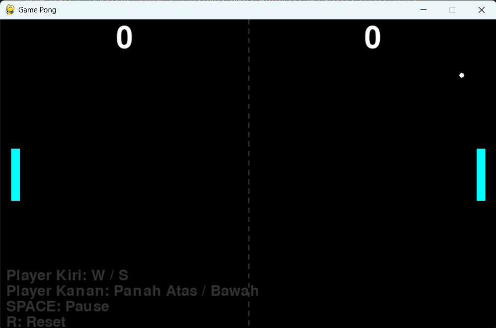
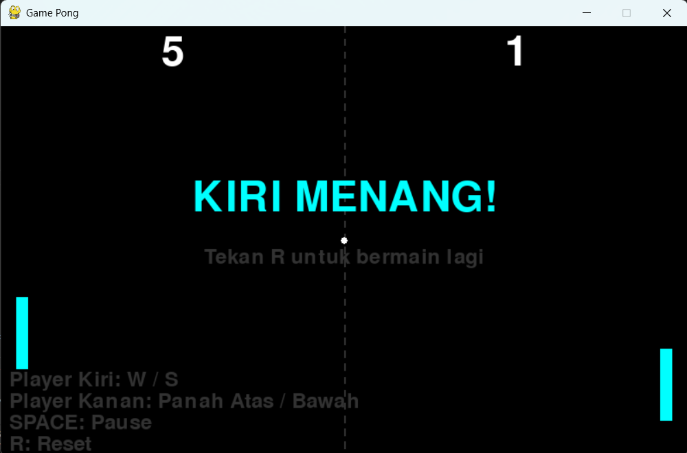

# 🎮 Game Pong

<div align="center">

**Aplikasi permainan Pong berbasis desktop dengan Pygame**

</div>

## 📋 Deskripsi Proyek

**Game Pong** adalah game desktop klasik yang dibangun menggunakan Python dan Pygame. Pemain mengendalikan dua paddle untuk memantulkan bola dan berusaha mencetak skor dengan melewati sisi lawan.

Permainan ini menampilkan kontrol dua pemain lokal, sistem skor real-time, kondisi game over saat salah satu pemain mencapai skor kemenangan, serta efek visual sederhana untuk pengalaman bermain yang lebih menarik.

Fitur utama aplikasi ini:
- Mode dua pemain lokal: pemain kiri (`W/S`) vs pemain kanan (`Arrow Up/Down`)
- Sistem skor hingga 5 poin untuk menentukan pemenang
- Pause game dengan `SPACE`
- Reset game dengan `R`
- Visual garis tengah putus-putus, skor besar, dan tampilan pemenang

## 📑 Daftar Isi

- [Deskripsi Proyek](#-deskripsi-proyek)
- [Tampilan Aplikasi](#-tampilan-aplikasi)
- [Fitur Utama](#-fitur-utama)
- [Teknologi yang Digunakan](#-teknologi-yang-digunakan)
- [Penjelasan File](#-penjelasan-file)
- [Cara Penggunaan](#-cara-penggunaan)
- [Peran Developer](#-peran-developer)
- [Pembelajaran dari Proyek](#-pembelajaran-dari-proyek-lessons-learned)
- [Ucapan Terima Kasih](#-ucapan-terima-kasih)

## 📸 Tampilan Aplikasi

### Tampilan Permainan




### Tampilan Game Over




## 🎯 Fitur Utama

### 🎮 Mode Permainan

| Mode | Deskripsi | Kontrol |
|------|-----------|---------|
| **Dua Pemain Lokal** | Pemain kiri melawan pemain kanan di layar yang sama | `W/S` dan `↑/↓` |

### 🥅 Skor dan Kemenangan

| Fitur | Deskripsi |
|-------|-----------|
| **Sistem Skor** | Skor ditampilkan di bagian atas layar untuk kedua pemain |
| **Target Kemenangan** | Permainan berakhir saat salah satu pemain mencapai `5` poin |
| **Reset** | Tekan `R` untuk memulai ulang permainan kapan saja |

### ⏸️ Kontrol dan Interaksi

| Aksi | Tombol |
|------|--------|
| **Gerakkan paddle kiri** | `W` / `S` |
| **Gerakkan paddle kanan** | `Arrow Up` / `Arrow Down` |
| **Pause / Unpause** | `SPACE` |
| **Reset permainan** | `R` |

### ✨ Visual dan Tampilan

| Komponen | Deskripsi |
|----------|-----------|
| **Garis Tengah Putus-putus** | Membagi layar menjadi dua bidang permainan |
| **Efek Glow Minimalis** | Paddle dan bola diberi border glow sederhana |
| **Tampilan Pemenang** | Pemenang ditampilkan saat skor mencapai target |

## 🛠️ Teknologi yang Digunakan

### Core Technologies

| Teknologi | Fungsi | Alasan Penggunaan |
|-----------|--------|-------------------|
| **Python 3.x** | Bahasa pemrograman utama | Cocok untuk game 2D ringan |
| **Pygame** | Game engine | Menyediakan window, input, rendering, dan loop game |

### Library yang Digunakan

| Library | Fungsi |
|---------|--------|
| **pygame** | Rendering grafik, event input, text, dan kontrol game |
| **sys** | Keluar aplikasi dengan bersih |
| **random** | Mengacak arah bola saat reset |

## 📄 Penjelasan File

### File Utama

| File | Fungsi |
|------|--------|
| **main.py** | Entry point game. Menginisialisasi Pygame, loop utama, input, update, dan render |
| **config.py** | Menyimpan konfigurasi layar, warna, kecepatan, ukuran paddle & bola, serta skor kemenangan |

### Package `game/`

| File | Fungsi |
|------|--------|
| **game/paddle.py** | Kelas `Paddle` untuk menggerakkan paddle, membatasi pergerakan, dan render |
| **game/ball.py** | Kelas `Ball` untuk logika pergerakan bola, pantulan, tabrakan, dan skor |
| **game/score.py** | Kelas `Score` untuk menyimpan skor kiri dan kanan serta menambah poin |

### Package `utils/`

| File | Fungsi |
|------|--------|
| **utils/draw.py** | Fungsi utilitas untuk menggambar teks dan garis putus-putus |

## 🎮 Cara Penggunaan

### Menjalankan Game

1. Pastikan Python dan Pygame sudah terinstal di komputer.
2. Buka terminal di folder `projects/game-pong`.
3. Jalankan perintah:

```bash
python main.py
```

### Kontrol Permainan

| Aksi | Tombol |
|------|--------|
| **Pindah paddle kiri ke atas** | `W` |
| **Pindah paddle kiri ke bawah** | `S` |
| **Pindah paddle kanan ke atas** | `Arrow Up` |
| **Pindah paddle kanan ke bawah** | `Arrow Down` |
| **Pause / lanjutkan game** | `SPACE` |
| **Reset permainan** | `R` |

### Tujuan Game

Sebagai setiap pemain, hindari bola melewati sisi Anda dan coba memasukkan bola ke sisi lawan. Pemain pertama mencapai `5` poin akan menjadi pemenang.

## 👨‍💻 Peran Developer

### Kontribusi Utama

| Area | Kontribusi |
|------|------------|
| **Desain Game** | Menciptakan ulang permainan Pong klasik dengan kontrol dua pemain |
| **Pengembangan Logika** | Menangani tumbukan bola, pergerakan paddle, dan sistem skor |
| **Antarmuka Visual** | Menambahkan garis tengah putus-putus dan tampilan pemenang |
| **Arsitektur Modular** | Memisahkan komponen ke `game/`, `utils/`, dan `config.py` |

## 📚 Pembelajaran dari Proyek

### Keterampilan Teknis

1. Pengembangan game 2D dengan Pygame
2. Event handling dan pergerakan real-time
3. Logika pantulan dan tabrakan objek
4. Manajemen state: pause, reset, game over
5. Pemecahan kode ke dalam modul yang terpisah

### Soft Skills

- Mendesain gameplay yang sederhana dan intuitif
- Mengatur alur kontrol dari dua pemain dalam satu layar
- Menyederhanakan logika game agar mudah dibaca dan dikembangkan

## 🙏 Ucapan Terima Kasih

### Referensi

- [Pygame Documentation](https://www.pygame.org/docs/) - Dokumentasi resmi Pygame
- [Python Documentation](https://docs.python.org/3/) - Referensi bahasa Python

### Inspirasi Proyek

- **Game Pong klasik** - Mekanik timeless dalam genre olahraga arkade
- **Game dua pemain lokal** - Tantangan kompetitif di layar yang sama

---

<div align="center">

**⭐ Jika proyek ini menarik, berikan bintang di GitHub! ⭐**

</div>
