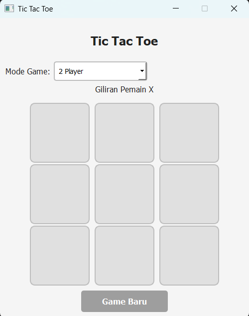

# 🎮 Tic Tac Toe Game

**Aplikasi permainan Tic Tac Toe berbasis desktop dengan PyQt5 dan AI**

## 📋 Deskripsi Proyek

**Tic Tac Toe Game** adalah aplikasi permainan papan Tic Tac Toe berbasis desktop yang dikembangkan menggunakan PyQt5 untuk antarmuka grafis. Proyek ini menawarkan mode dua pemain dan mode melawan AI dengan tiga tingkat kesulitan yang berbeda.

Tic Tac Toe dimainkan di papan 3x3. Dua pemain bergantian menempatkan simbol X dan O. Tujuannya adalah menjadi pemain pertama yang mendapatkan tiga simbol berurutan secara horizontal, vertikal, atau diagonal.

Fitur utama aplikasi ini:
- Dua Mode Permainan: Multiplayer dan AI 
- AI dengan Tiga Tingkat Kesulitan: Easy, Medium , Hard
- Algoritma Minimax: Implementasi AI sempurna untuk tingkat kesulitan Hard
- Antarmuka Modern: Desain bersih dengan PyQt5 dan stylesheet khusus

## 📑 Daftar Isi

- [Deskripsi Proyek](#-deskripsi-proyek)
- [Tampilan Aplikasi](#-tampilan-aplikasi)
- [Latar Belakang](#-latar-belakang)
- [Fitur Utama](#-fitur-utama)
- [Teknologi yang Digunakan](#-teknologi-yang-digunakan)
- [Cara Penggunaan](#-cara-penggunaan)
- [Peran Developer](#-peran-developer)
- [Pembelajaran dari Proyek](#-pembelajaran-dari-proyek-lessons-learned)
- [Ucapan Terima Kasih](#-ucapan-terima-kasih)

## 📸 Tampilan Aplikasi

### Tampilan Utama

## 🎯 Latar Belakang

Proyek ini dibuat untuk mengembangkan keterampilan dalam:

- **Pengembangan GUI dengan PyQt5**: Mempelajari cara membuat aplikasi desktop interaktif dengan framework PyQt5
- **Kecerdasan Buatan (AI)**: Mengimplementasikan algoritma Minimax untuk AI yang tidak terkalahkan
- **Desain Modular**: Mendesain aplikasi dengan pemisahan logika game, AI, dan UI
- **Event-Driven Programming**: Menangani interaksi pengguna dan pembaruan antarmuka secara real-time

Kebutuhan yang melatarbelakangi proyek ini:
- **Memperdalam pemahaman PyQt5** untuk pengembangan aplikasi desktop
- **Eksplorasi AI dalam game** dengan berbagai tingkat kesulitan
- **Pembelajaran tentang algoritma pencarian** seperti Minimax dengan alpha-beta pruning (implisit)

## 🌟 Fitur Utama

### 🎮 **Dua Mode Permainan**

| Mode | Deskripsi | Pemain |
|------|-----------|--------|
| **Multiplayer** | Dua pemain bergantian di komputer yang sama | Manusia vs Manusia |
| **vs AI** | Pemain melawan AI dengan tiga tingkat kesulitan | Manusia vs AI |

### 🤖 **AI dengan Tiga Tingkat Kesulitan**

| Tingkat | Random Factor | Strategi |
|---------|---------------|----------|
| **Easy** | 100% random | Selalu memilih gerakan acak |
| **Medium** | 30% random | 70% menggunakan minimax, 30% gerakan acak |
| **Hard** | 0% random | Menggunakan algoritma Minimax murni |

### 🧠 **Algoritma AI**

| Komponen | Deskripsi |
|----------|-----------|
| **Minimax** | Algoritma rekursif untuk mengevaluasi semua kemungkinan gerakan |
| **Skor Dinamis** | AI menang = 10 - kedalaman, Pemain menang = -10 + kedalaman, Seri = 0 |
| **Optimal Play** | AI Hard selalu memilih gerakan terbaik dan tidak bisa dikalahkan |

### 🎨 **Antarmuka Pengguna**

| Komponen | Deskripsi |
|----------|-----------|
| **Papan Permainan** | Grid 3x3 dengan tombol besar (120x120) |
| **Dropdown Mode** | Pilihan mode game: 2 Player, vs AI (Easy/Medium/Hard) |
| **Status Label** | Menampilkan giliran pemain atau hasil akhir |
| **Tombol Reset** | Memulai permainan baru tanpa menutup aplikasi |
| **Visual Feedback** | Tomot dinonaktifkan setelah diklik, AI berpikir ditampilkan |
| **Delay AI** | Jeda 300ms sebelum AI bergerak untuk pengalaman lebih alami |

### 📊 **Sistem Skor Minimax**

| Kondisi | Skor |
|---------|------|
| AI Menang | 10 - kedalaman (prioritaskan kemenangan cepat) |
| Pemain Menang | -10 + kedalaman (hindari kekalahan, tunda jika mungkin) |
| Seri | 0 |

## 🛠️ Teknologi yang Digunakan

### Core Technologies

| Teknologi | Fungsi | Alasan Penggunaan |
|-----------|--------|-------------------|
| **Python 3.7+** | Bahasa pemrograman utama | Mudah dipelajari, library melimpah |
| **PyQt5** | Framework GUI | Aplikasi desktop profesional, styling mudah dengan CSS |
| **PyQt5.QtCore** | Timer dan event | QTimer untuk delay AI tanpa memblokir UI |

### Library yang Digunakan

| Library | Fungsi | Penggunaan |
|---------|--------|------------|
| **PyQt5.QtWidgets** | Widget GUI | QMainWindow, QPushButton, QLabel, QComboBox |
| **PyQt5.QtCore** | Core functionality | Qt.AlignCenter, QTimer |
| **random** | Randomization | Random factor untuk AI Easy dan Medium |
| **math** | (Tidak digunakan langsung) | Untuk kemungkinan ekspansi di masa depan |

### Penjelasan File

#### File Utama

| File | Fungsi |
|------|--------|
| **main.py** | Entry point aplikasi. Menginisialisasi QApplication dan menampilkan jendela utama. |

#### Package `game/` (Logika Permainan)

| File | Fungsi |
|------|--------|
| **game/board.py** | Kelas `Board` untuk merepresentasikan papan 3x3. Menangani validasi gerakan, pengecekan pemenang, kondisi seri, dan mendapatkan sel kosong. |
| **game/ai_player.py** | Kelas `AIPlayer` untuk kecerdasan buatan. Implementasi tiga tingkat kesulitan (Easy, Medium, Hard) dengan algoritma Minimax. |
| **game/game_logic.py** | Kelas `GameLogic` untuk logika utama. Menghubungkan board dengan AI, menangani pergantian giliran, dan menentukan kondisi game over. |

#### Package `ui/` (Antarmuka Pengguna)

| File | Fungsi |
|------|--------|
| **ui/main_window.py** | Kelas `TicTacToeWindow` untuk jendela utama. Menampilkan papan 3x3 tombol, dropdown mode, status label, dan tombol reset. Menangani klik sel dan memanggil AI dengan QTimer. |
| **ui/styles.py** | Fungsi `apply_styles()` yang mengembalikan stylesheet CSS untuk semua widget (warna, hover, font, border radius). |

#### Package `utils/` (Utilitas)

| File | Fungsi |
|------|--------|
| **utils/constants.py** | Konstanta warna (COLORS), ukuran (WINDOW_SIZE, BOARD_SIZE), mode game (MODE_2_PLAYER, MODE_AI_EASY, dll), dan simbol pemain (X, O, EMPTY). |

## 🎮 Cara Penggunaan

### Menu Utama

Setelah aplikasi dijalankan, Anda akan melihat jendela utama dengan:

| Komponen | Fungsi |
|----------|--------|
| **Dropdown Mode Game** | Memilih mode permainan |
| **Status Label** | Menampilkan giliran atau hasil permainan |
| **Papan 3x3** | 9 tombol untuk meletakkan simbol |
| **Tombol Game Baru** | Mereset permainan |

### Mode 2 Player

**Cara bermain:**
1. Pilih **"2 Player"** dari dropdown
2. Pemain X memulai lebih dulu
3. Klik pada sel kosong di papan untuk meletakkan simbol
4. Giliran bergantian antara X dan O
5. Permainan berakhir ketika ada pemenang atau papan penuh (seri)

### Mode vs AI

**Cara bermain:**
1. Pilih tingkat kesulitan: **vs AI (Easy)**, **vs AI (Medium)**, atau **vs AI (Hard)**
2. Pemain X (Anda) memulai lebih dulu
3. Klik pada sel kosong untuk bergerak
4. AI akan bergerak otomatis setelah jeda 300ms
5. Status "AI sedang berpikir..." akan ditampilkan selama jeda

**Tingkat Kesulitan AI:**

| Tingkat | Deskripsi | Cocok untuk |
|---------|-----------|-------------|
| **Easy** | 100% gerakan acak, mudah dikalahkan | Pemula yang baru belajar |
| **Medium** | 70% minimax + 30% acak, cukup menantang | Pemain kasual |
| **Hard** | Minimax murni, tidak bisa dikalahkan | Pemain yang ingin tantangan maksimal |

### Menampilkan Hasil Permainan

| Kondisi | Status Label |
|---------|--------------|
| Pemain X menang (2 Player) | "Pemain X menang!" |
| Pemain O menang (2 Player) | "Pemain O menang!" |
| AI menang | "AI menang!" |
| Seri | "Hasil Seri!" |

### Kontrol

| Aksi | Cara |
|------|------|
| **Memilih mode** | Klik dropdown dan pilih mode |
| **Meletakkan simbol** | Klik pada sel papan |
| **Game baru** | Klik tombol "Game Baru" |
| **Keluar aplikasi** | Tutup jendela |

## 👨‍💻 Peran Developer

### Peran dalam Proyek

| Area | Kontribusi |
|------|------------|
| **Perencanaan** | Merancang fitur dengan 2 mode dan 3 tingkat kesulitan AI |
| **Desain Arsitektur** | Mendesain struktur folder modular (game/, ui/, utils/) |
| **Pengembangan Game Logic** | Implementasi kelas `Board` untuk aturan Tic Tac Toe |
| **Pengembangan AI** | Implementasi kelas `AIPlayer` dengan algoritma Minimax dan random factor |
| **Pengembangan GUI** | Membangun antarmuka dengan PyQt5 (tombol grid, dropdown, label) |
| **UI/UX Design** | Mendesain tampilan modern dengan CSS, delay AI untuk UX lebih baik |
| **State Management** | Flag `is_ai_thinking` untuk mencegah race condition |
| **Testing** | Menguji semua mode dan tingkat kesulitan |

### Fokus Pengembangan

1. **Fungsionalitas Inti**
   - Aturan Tic Tac Toe yang akurat
   - Dua mode permainan yang berbeda
   - AI dengan tiga tingkat kesulitan

2. **User Experience**
   - Antarmuka bersih dengan PyQt5
   - Status label informatif
   - Feedback visual saat AI berpikir
   - Delay AI untuk gerakan lebih alami

3. **AI dan Strategi**
   - Algoritma Minimax untuk AI Hard
   - Random factor untuk Easy dan Medium
   - Skor dinamis (10 - depth) untuk prioritas kemenangan cepat

4. **Arsitektur Modular**
   - Pemisahan UI, logika game, dan AI
   - Konstanta terpusat di `constants.py`
   - Stylesheet terpisah untuk kemudahan kustomisasi

## 📚 Pembelajaran dari Proyek (Lessons Learned)

### Keterampilan Teknis yang Diperoleh

1. **PyQt5 untuk GUI Desktop**
   - QMainWindow, QWidget, layout management
   - QPushButton dengan grid layout
   - QComboBox untuk pilihan mode
   - QTimer untuk delay non-blocking

2. **Algoritma Minimax untuk AI**
   - Implementasi rekursif dengan depth
   - Evaluasi posisi dengan skor dinamis
   - Simulasi semua kemungkinan gerakan

3. **Event-Driven Programming**
   - Menangani sinyal clicked dari tombol
   - Update UI berdasarkan state game
   - Mencegah multiple event dengan flag

4. **State Management**
   - Manajemen giliran pemain
   - Flag untuk mencegah AI bergerak saat berpikir
   - Reset state untuk game baru

5. **CSS Styling di PyQt5**
   - Styling tombol, label, dan dropdown
   - Hover effects untuk interaktivitas
   - Warna konsisten dengan konstanta

### Soft Skills yang Dikembangkan

#### 1. **Problem Decomposition**
- Memecah game menjadi komponen: board, AI, game logic, UI
- Memisahkan logika permainan dari antarmuka
- Mendesain hirarki kelas yang jelas

#### 2. **Algorithm Design**
- Merancang algoritma Minimax untuk AI
- Menyeimbangkan random dan strategi untuk tingkat kesulitan
- Menentukan skor dinamis (10 - depth)

#### 3. **User Experience Design**
- Mendesain antarmuka yang intuitif
- Memberikan status label informatif
- Delay AI untuk gerakan lebih alami

#### 4. **Defensive Programming**
- Validasi input sebelum eksekusi
- Flag `is_ai_thinking` untuk mencegah race condition
- Pengecekan game over sebelum AI bergerak

## 🙏 Ucapan Terima Kasih

### Sumber Daya dan Referensi

#### Dokumentasi Resmi
- [PyQt5 Documentation](https://www.riverbankcomputing.com/static/Docs/PyQt5/) - Framework GUI
- [Python Documentation](https://docs.python.org/3/) - Bahasa pemrograman

#### Tutorial dan Artikel
- **PyQt5 Tutorials** - Untuk mempelajari dasar-dasar PyQt5
- **Minimax Algorithm Explained** - Untuk implementasi AI optimal
- **Tic Tac Toe Strategy** - Untuk memahami strategi permainan

#### Tools yang Membantu
- **Visual Studio Code** - Editor kode
- **Qt Designer** - (Referensi) Untuk desain UI visual

### Inspirasi Proyek
- **Game Tic Tac Toe klasik** - Aturan dan mekanisme dasar
- **AI dalam game** - Konsep Minimax untuk permainan dua pemain
- **Proyek Othello** - Format README yang terstruktur dan inspirasi gaya penulisan

---

**⭐ Jika proyek ini menarik atau bermanfaat, berikan bintang! ⭐**

**"Tic Tac Toe sederhana di permukaan, namun menjadi kompleks saat AI bermain sempurna"**

